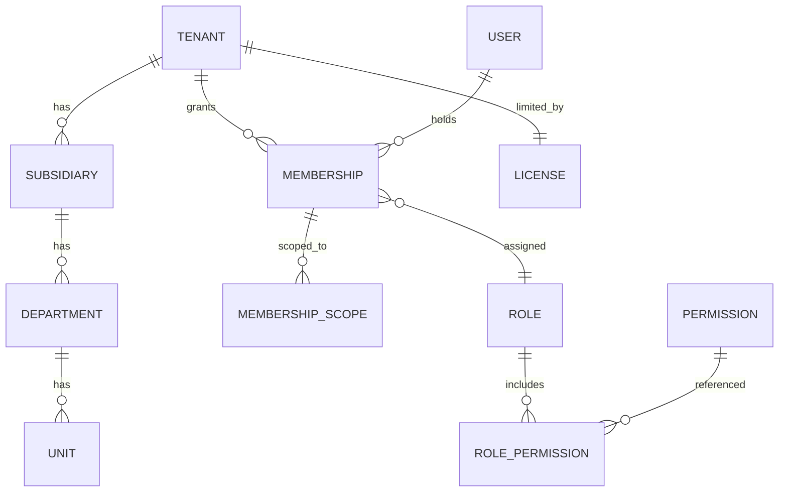
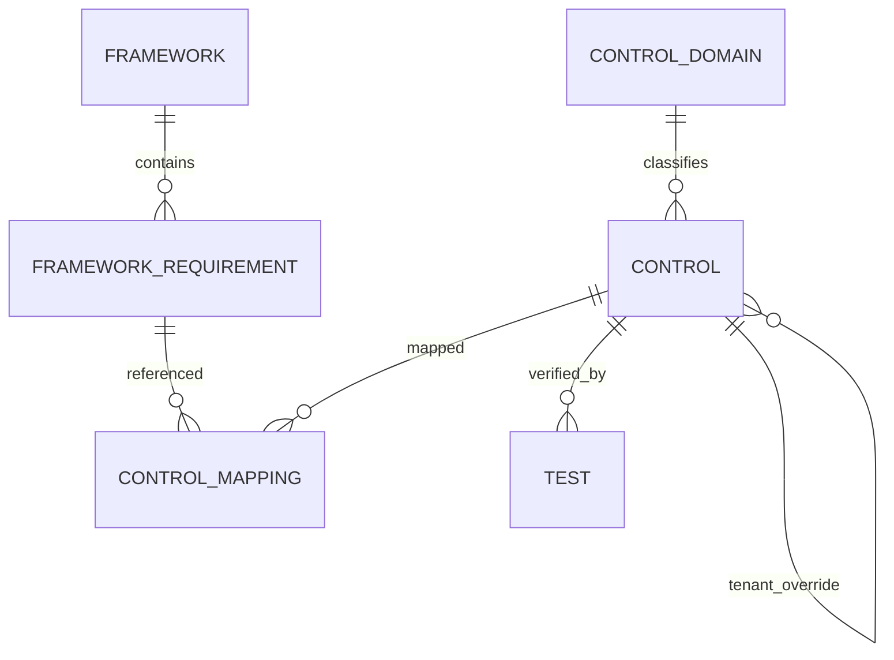
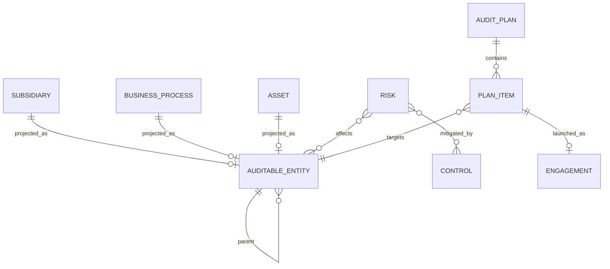
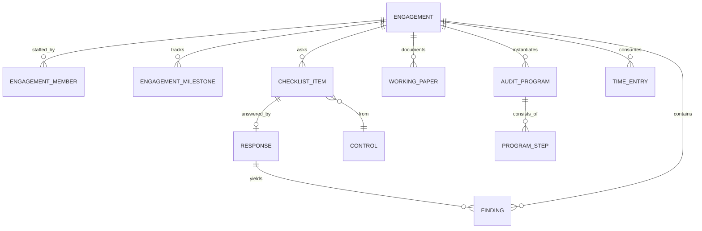
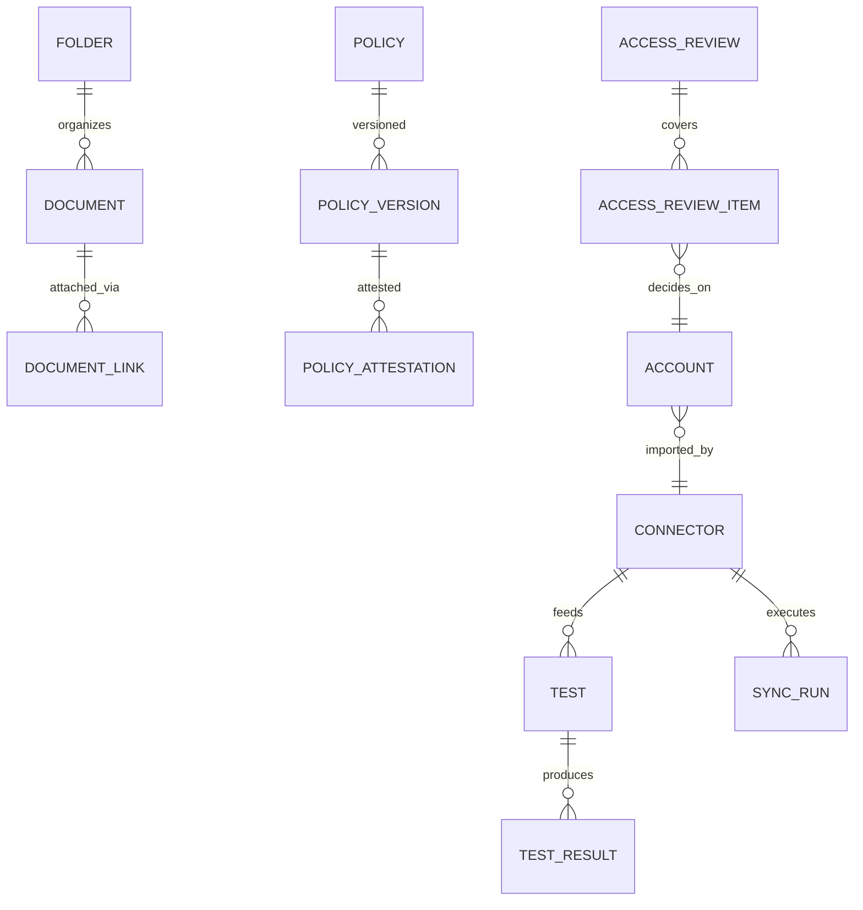

# Модель данных (ERD) — IT Audit Platform

T-003. Основа: ADR-0001…0017, [CONTEXT.md](../CONTEXT.md), [checklist-analysis.md](client-templates/checklist-analysis.md), [rfp-coverage.md](client-templates/rfp-coverage.md). Этот документ — будущий ответ на требование **DAT-02** RFP (документированная модель данных).

Статус: **утверждён Рашадом 18.07.2026** (T-003 закрыта). Открытые вопросы §11 приняты по дефолтам: management_response — поле finding'а (эволюционирует при необходимости), иерархия требований — parent_id + версия фреймворка, Unit остаётся в MVP. Основа для миграций (T-010).

---

## 1. Сквозные паттерны (применяются ко всем таблицам)

| Паттерн | Решение |
|---|---|
| **PK** | `id uuid` (UUIDv7 — сортируемость по времени) |
| **Tenancy** | `tenant_id uuid NOT NULL` во всех доменных таблицах; **RLS-политика на каждой** (ADR-0003). Исключения: глобальные справочники (`tenant_id NULL` = продуктовый шаблон, ADR-0016) и над-тенантные `user`, `tenant` |
| **Изоляция MTE-04** | Ни одного FK между данными разных тенантов. Единственные над-тенантные связи: `membership → user/tenant`. Это делает опцию schema-per-tenant механическим переносом |
| **Мультиязычность** (ADR-0009) | Переводимые поля контента — `jsonb`: `{"en": "...", "az": "...", "ru": "..."}`, fallback EN. Суффикс `_i18n`. UI-строки — не в БД (i18n-каркас), per-tenant терминология — `terminology_override` |
| **Custom fields** (GEN-07) | На крупных сущностях колонка `custom jsonb DEFAULT '{}'` + реестр `custom_field_def`. Без EAV-таблиц |
| **Настраиваемые списки** (GEN-06/ENG-09) | Не hardcoded enum, а lookup-таблицы с `system_category` (семантика для логики) + `label_i18n` (отображение). Сиды — из чеклиста клиента |
| **Audit trail** (LOG-01/02) | `audit_log` append-only, hash-chain (EP-HARDEN). Пишется триггером/сервисом на каждое изменение |
| **Soft delete** | `deleted_at timestamptz NULL` (T-023); гранулярный restore (BCK-04) |
| **Timestamps** | `created_at`, `updated_at` везде; `created_by`, `updated_by uuid` |
| **SLA** (B15) | Пара `due_date date` + `sla_status` (computed: ok/due_soon/overdue) на finding/test/task — пересчёт фоновой джобой (T-043) |

---

## 2. Identity, организация, лицензии

**tenant** — группа компаний. `name`, `slug`, `settings jsonb` (таймзона, расписание уведомлений GMT+4 и т.п.), `language_default`.

**subsidiary** — дочка. `tenant_id`, `name_i18n`, `code`, `country`, `business_profile jsonb` (сегмент, операции — вход для AI-подбора контролей), `status`. Также узел universe (§4).

**department** / **unit** — оргструктура. `department`: `tenant_id`, `subsidiary_id NULL` (NULL = группа/аудит-функция), `name_i18n`. `unit`: `department_id`, `name_i18n`.

**user** — над-тенантный (ADR-0015). `email UNIQUE`, `password_hash NULL` (NULL при чистом SSO), `mfa_totp_secret`, `mfa_enabled`, `full_name`, `phone`, `locale`, `position`, `certifications jsonb` (CISA, CISM…: name/issuer/valid_until), `status` (active/invited/deactivated), `last_login_at`.

**membership** — User↔Tenant (ADR-0015). `user_id`, `tenant_id`, `role_id`, `category` (`auditor`/`respondent`/`msp`/`external_auditor`), `department_id NULL`, `unit_id NULL`, `is_audit_seat bool` (тарификация ADR-0014), `invited_by`, `status`. UNIQUE(user_id, tenant_id).

**membership_scope** — ограничение membership подмножеством дочек: `membership_id`, `subsidiary_id`. Пусто = вся группа (по роли). _(Реализовано как jsonb-поле `membership.subsidiary_scope`, не отдельная таблица — см. §12.)_

**role** — `tenant_id NULL` (NULL = системные пресеты: Admin, View-only Admin, Editor, Collaborator, Assessor, Manager, Approver), `name_i18n`, `is_system`.

**permission** — глобальный каталог: `resource` (engagement, finding, control, report, settings…), `action` (view/create/edit/delete/approve/export…). **role_permission**: `role_id`, `permission_id`, `level` (`none`/`view`/`edit`) — матрица ADR-0013.

**license** — ADR-0014: `tenant_id`, `plan`, `max_subsidiaries int`, `max_audit_seats int`, `valid_until`, `terms` (perpetual/subscription — открытый вопрос). Потребление считается запросом (subsidiaries count, memberships is_audit_seat), снапшоты — `usage_snapshot` (для биллинга/истории).

**auth-журналы** (LOG-04/05): `auth_event` (`user_id`, `event` login/logout/failed/locked, `ip`, `user_agent`, `at`); выдача прав пишется в `audit_log` (entity=membership/role).

---

## 3. Библиотека: фреймворки и контроли

**framework** — стандарт: `tenant_id NULL`=глобальный (ISO 27001, COBIT, NIST CSF, CBAR…; ADR-0016), `name`, `version` (ISO 27001:2022), `status`, `source_framework_id NULL` (tenant-копия → глобальный оригинал). Обновление версии = новая строка + tracked changes (EP-FWK).

**framework_requirement** — пункт стандарта: `framework_id`, `ref` (A.5.1), `title_i18n`, `text_i18n`, `parent_id` (иерархия пунктов). **Единственный источник ссылок на стандарты** (ADR-0004).

**control_domain** — таксономия (сид: 16 доменов чеклиста GOV/AC/CM/…): `code`, `name_i18n`, `tenant_id NULL`.

**control** — ADR-0016 global+override: `tenant_id NULL`=глобальный, `origin_control_id NULL` (адаптация → оригинал), `ref` (AC-03), `domain_id`, `objective_i18n`, `question_i18n` (4 поля чеклиста), `guidance_i18n`, `owner_membership_id NULL`, `status`, `custom jsonb`.

**control_mapping** — Control↔Requirement M:N: `control_id`, `requirement_id`. Мультифреймворк-маппинг (Vanta-паттерн).

---

## 4. Audit Universe, риски, планирование

**auditable_entity** — узел universe (UNI-01, дерево неограниченной глубины): `tenant_id`, `parent_id NULL`, `kind` (`subsidiary`/`process`/`system`/`location`/`activity`/`function`), `ref_id NULL` (FK на специализированную сущность), `name_i18n`, `description_i18n`, `owner_membership_id`, `custom jsonb`. Permanent files — через `document_link` (UNI-02).

**business_process** — ADR-0016 гибрид: `tenant_id`, `subsidiary_id NULL` (NULL = каталог группы), `name_i18n`, `criticality`, `owner_membership_id`, скоринг-поля.

**asset** — ИТ-актив: `tenant_id`, `subsidiary_id`, `type` (ERP/DB/network/app/cloud…), `name`, `owner_membership_id`, `connector_id NULL` (авто-обнаружен, B3), `attrs jsonb`, `custom jsonb`.

**risk** — реестр: `tenant_id`, `subsidiary_id NULL`, `domain` (IT/ИБ/кибербез/governance), `title_i18n`, `description_i18n`, `category`, `inherent_impact int`, `inherent_likelihood int`, `residual_impact`, `residual_likelihood`, `risk_class` (computed по матрице), `treatment` (mitigate/transfer/accept/avoid), `owner_membership_id`, `approver_membership_id`, `status`, `source_risk_id NULL` (из глобальной risk library). M:N: **risk_entity** (risk↔auditable_entity), **risk_control** (RCM, CTL-02).

**risk_matrix_config** — RSK-02/05: `tenant_id`, шкалы impact/likelihood, пороги классов, `weights jsonb` (конфигурируемые критерии скоринга).

**risk_assessment** — сессия оценки (RSK-01): `tenant_id`, `title`, `period`, `status`, `methodology_note`; документы — через `document_link`; охват — M:N с auditable_entity.

**audit_plan** — UNI-03: `tenant_id`, `title`, `horizon_start/end`, `status` (draft/approved/active/archived), `revision int`, `parent_plan_id NULL` (ревизии плана UNI-08).

**plan_item** — строка плана: `plan_id`, `auditable_entity_id`, `audit_type_id`, `priority_score numeric` (+ `score_breakdown jsonb` — по критериям с весами, UNI-04), `planned_hours`, `planned_quarter`, `recurrence jsonb NULL` (UNI-05), `assigned_membership_ids`, `engagement_id NULL` (после запуска ENG-01).

**capacity**: `auditor_capacity` (`tenant_id`, `membership_id`, `period`, `available_hours`) — вместе с time_entry даёт утилизацию (SCH-03, UNI-07).

---

## 5. Engagement, fieldwork, findings

**audit_type** — lookup (UNI-06): сид operational/financial/it/compliance/quality/advisory; `tenant_id NULL`+override.

**engagement** — ядро (ADR-0005): `tenant_id`, `subsidiary_id`, `audit_type_id`, `title_i18n`, `period_start/end`, `mode` (`formal`/`light`), `state` (§8), `opinion_id NULL` (lookup, ENG-09; _колонка выпилена — заключение через lookup `audit_opinion`, см. §12_), `plan_item_id NULL`, `custom jsonb`, `archived_at NULL` (ENG-08).

**engagement_member** — GEN-08/SCH-02: `engagement_id`, `membership_id`, `engagement_role` (lead/assessor/reviewer/approver/observer), `stage_permissions jsonb NULL` (переопределение по стадиям: read-only/hidden/edit). _(Реализовано T-116, миграция 0070 — см. §12.)_

**engagement_milestone** — ENG-03: `engagement_id`, `stage`, `planned_date`, `actual_date NULL`.

**checklist_item** — пункт чеклиста engagement'а. **Снапшот контроля на момент включения** (текст копируется — отчёт не должен «поплыть» при правке библиотеки): `engagement_id`, `control_id NULL` (origin), `ref`, `domain_code`, `objective_i18n`, `question_i18n`, `order`, `assigned_respondent_id NULL`, `status`.

**response** — «вторая колонка»: `checklist_item_id UNIQUE`, `respondent_membership_id`, `text`, `compliance_status` (lookup: Compliant/Partially/Non-Compliant/N-A), `submitted_at`; evidence — `document_link` (Evidence Reviewed).

**finding** — «третья колонка» (глоссарий): `tenant_id`, `engagement_id NULL` (standalone допустим), `checklist_item_id NULL`, `response_id NULL`, `control_id NULL`, `risk_id NULL`, `title_i18n`, `description_i18n` (gap как риск), `risk_rating` (lookup Critical…N/A), `recommendation_i18n` (remediation/action plan), `owner_membership_id` (auditee-side), `auditor_membership_id` (audit-side owner), `due_date`, `sla_status`, `status_id` (lookup §7), `remediated_at NULL`, `retest_result NULL` (`passed`/`failed`), `retested_by NULL`, `resolution_date NULL`, `management_response TEXT NULL`, `custom jsonb`. Re-test обязателен для закрытия в formal-режиме (диаграмма RFP).

**working_paper** — EP-WPAPERS: `engagement_id`, `program_step_id NULL`, `title`, `content jsonb` (rich-text документ, Tiptap), `status` (draft/prepared/reviewed/signed_off), `preparer_id`, `reviewer_id` (≠ preparer, WP-07), `edited_since_review bool` (WP-08), `custom jsonb`. **sign_off**: `working_paper_id`, `membership_id`, `role` (preparer/reviewer/approver), `signed_at`, `note` — атрибутируемые подписи.

**audit_program** — ENG-04/05: `tenant_id NULL`=библиотечный шаблон / `engagement_id NULL`=инстанс, `origin_program_id NULL` (roll-forward), `subject_area`, `title_i18n`. **program_step**: `program_id`, `order`, `title_i18n`, `instructions_i18n`, `assigned_membership_id NULL`, `status`, `working_paper_id NULL`.

**time_entry** — EP-TIME: `tenant_id`, `membership_id`, `date`, `hours numeric`, `engagement_id NULL`, `phase NULL` (planning/fieldwork/reporting), `program_step_id NULL`, `category` (`audit`/`training`/`leave`/`admin`… SCH-07), `billable_rate NULL` (TIME-03), `note`.

---

## 6. Доказательства, тесты, коннекторы, governance

**document** — файл (T-042): `tenant_id`, `folder_id NULL`, `storage_key`, `filename`, `mime`, `size`, `sha256`, `version int`, `prev_version_id NULL`, `owner_membership_id`, `renew_by NULL` (cadence), `status`. **folder**: `tenant_id`, `parent_id`, `context` (engagement/universe-node/policy…), `name_i18n` (UNI-02/WP-04). **document_link** — полиморфная привязка: `document_id`, `entity_type`, `entity_id`, `relation` (`evidence`/`permanent_file`/`attachment`/`report`), UNIQUE по тройке. Cross-reference WP-05 (одна версия из многих мест) — решается именно линками.

**test** — ADR-0010: `tenant_id`, `control_id`, `title_i18n`, `kind` (`manual`/`automated`), `connector_id NULL`, `check_config jsonb` (правило автопроверки), `frequency` (continuous/daily/quarterly…), `owner_membership_id`, `due_date`, `sla_status`, `status` (ok/failing/needs_attention/deactivated). **test_result**: `test_id`, `run_at`, `outcome` (pass/fail/error), `failing_entities jsonb` (список объектов), `evidence_document_id NULL`, `details jsonb`.

**connector** — ADR-0011: `tenant_id`, `provider` (entra/aws/jira/ldap/…), `capabilities text[]` (access/inventory/personnel/evidence/vulns/tasks), `config_encrypted`, `status`, `last_sync_at`. **sync_run**: `connector_id`, `started/finished`, `outcome`, `stats jsonb`, `error`.

**policy** — B4: `tenant_id`, `title_i18n`, `owner_membership_id`, `approver_membership_id`, `renew_by`, `status` (draft/in_review/approved/archived), `framework_ids` (маппинг). **policy_version**: `policy_id`, `version`, `document_id`, `approved_at/by`, `changelog`. **policy_attestation**: `policy_version_id`, `membership_id`, `attested_at`, `status`.

**vendor** — B5: `tenant_id`, `subsidiary_id NULL`, `name`, `category`, `url`, `inherent_risk`, `residual_risk`, `security_owner_id`, `status` (procurement/active/archived), `intake jsonb` (настраиваемая intake-форма), `custom jsonb`. **vendor_assessment**: `vendor_id`, `type`, `state`, `due_date`, `owner_id`, `recommendation`, `evidence_status`.

**account** — ADR-0012 (IAM): `tenant_id`, `subsidiary_id NULL`, `source_system` (или `connector_id`), `identifier`, `display_name`, `owner_membership_id NULL`, `groups text[]`, `type` (human/service), `mfa_enabled bool NULL`, `status` (active/deactivated), `created_in_source`, `deactivated_in_source`. **access_review** (кампания UAR): `tenant_id`, `title`, `period`, `scope jsonb`, `status`, `due_date`. **access_review_item**: `review_id`, `account_id`, `reviewer_id`, `decision` (certify/revoke/modify), `decided_at`, `finding_id NULL` (порождает finding). **access_request**: `tenant_id`, `requester_id`, `system`, `justification`, `status`, `approver_id`. **deprovisioning_task**: `tenant_id`, `account_id`, `reason`, `due_date`, `status`, `sla_status`.

**notification** — T-039/041: `tenant_id`, `user_id`, `type` (finding_assigned/deadline_approaching/test_failed/digest…), `entity_type/entity_id`, `channel` (email/in_app), `payload jsonb`, `scheduled_at`, `sent_at`, `read_at`. Правила/расписание (quiet hours, digest по понедельникам — как Vanta) — в `tenant.settings`.

**audit_log** — T-021/LOG: `tenant_id NULL` (системные события), `actor_user_id`, `actor_ip`, `action`, `entity_type`, `entity_id`, `before jsonb`, `after jsonb`, `at`, `prev_hash`, `hash` (chain, EP-HARDEN). Append-only: без UPDATE/DELETE (revoke + RLS).

**custom_field_def** — GEN-07: `tenant_id`, `entity_type`, `key`, `label_i18n`, `field_type` (text/number/date/select/multiselect/user), `options jsonb`, `required`, `position`. **terminology_override** — GEN-06: `tenant_id`, `i18n_key`, `locale`, `label`.

---

## 7. Настраиваемые списки (lookup) и их сиды

Все три — из чеклиста клиента, дословно; `tenant_id NULL` = сид, тенант может добавлять свои значения (EP-CONFIG). Поле `system_category` фиксирует семантику для логики/дашбордов.

**compliance_status**: Compliant · Partially Compliant · Non-Compliant · Not Applicable
**risk_rating**: Critical · High · Medium · Low · N/A
**finding_status** (`system_category` в скобках): Not Started (open) · Open (open) · In Progress (in_progress) · **Pending Re-test (in_progress)** · Closed (closed) · Overdue (computed из SLA)
**audit_opinion** (ENG-09), **audit_type** (UNI-06) — аналогично.

Цветовая кодировка значений (из условного форматирования чеклиста) — атрибут `color` в lookup.

## 8. State machines

**Engagement** (ADR-0005; formal-режим — все переходы принудительные, light — согласования пропускаемы):
`draft → manager_review → issued_to_respondents → responses_in_progress → findings_drafting → management_response → approval → report_issued → follow_up → closed` (+ `archived` из closed; `paused` из любого — SCH-06).

**Finding** (T-039 + re-test из диаграммы RFP):
`identified → assigned → in_progress → remediated(владелец отметил) → pending_retest → [retest passed → closed | retest failed → in_progress]`. `overdue` — вычисляемый флаг SLA, не состояние.

**Working paper**: `draft → prepared → in_review → reviewed → signed_off`; правка после reviewed ⇒ `edited_since_review=true`.

## 9. Паритет M2/M3 — заглушки (проектируются при декомпозиции эпиков)

Таблицы придут по стандартным паттернам §1: `vulnerability`, `code_change`, `security_alert`, `device` (EP-VULN/EP-PERS); `processing_activity`, `privacy_assessment` (EP-PRIV); `questionnaire`, `questionnaire_answer`, `kb_entry` (EP-QA); `commitment` (EP-MISC); `trust_center_*` (EP-TRUST). В ядро не входят; ERD гарантирует им место (tenant_id, document_link, custom, audit_log — универсальны).

## 10. Ключевые решения (и альтернативы)

1. **Checklist_item = снапшот контроля**, а не FK-ссылка на живой текст. Иначе правка библиотеки задним числом меняет выпущенные отчёты — для аудита недопустимо. Цена — дублирование текста; принято.
2. **Lookup-таблицы вместо enum** для всех пользовательских списков — требование GEN-06/ENG-09 (конфигурируемость) при сохранении семантики через `system_category`.
3. **Custom fields = jsonb + реестр определений**, не EAV — проще запросы/индексация (GIN), достаточно для GEN-07.
4. **Universe = umbrella-таблица** `auditable_entity` с `kind`+`ref_id` на специализированные (subsidiary/process/asset), а не отдельные деревья — единое дерево UNI-01 и единая точка для plan/risk-связей.
5. **document_link (полиморфный)** вместо N join-таблиц — evidence/permanent files нужны на 10+ сущностях; полиморфизм оправдан, целостность — на уровне сервиса + частичные индексы.
6. **User над тенантами + membership** (ADR-0015) — единственное над-тенантное место модели; всё остальное строго внутри тенанта (совместимость MTE-04).
7. **Finding режет связи опционально** (engagement/checklist/response/control все NULL-able) — standalone findings и access-review findings живут в той же таблице; един trekker/дашборд/SLA.

## 11. Открытые вопросы к ревью
1. `management_response` — поле finding'а или отдельная сущность с историей раундов (аудитор↔менеджмент)? Пока поле; RFP WP-02 упоминает как часть WP.
2. Иерархия требований фреймворка: достаточно `parent_id` или нужна отдельная версия под tracked changes фреймворков (EP-FWK)? Пока `parent_id` + версия на уровне framework.
3. Единицы (`unit`) — нужны ли в MVP или достаточно department? (Клиент упоминал оба.) Пока обе таблицы.

## 12. Сверка docs↔code (T-121, 20.07.2026)

Расхождения между этим документом и реализацией. По каждому — решение: **реализовано**, **осознанная замена** или **отложено**. Актуально на момент закрытия EP-AUDITOR-RELATIONSHIP.

| # | Docs (этот файл) | Код | Решение |
|---|---|---|---|
| 1 | `membership_scope` — отдельная таблица (§2) | jsonb-поле `membership.subsidiary_scope` (T-012), без отдельной таблицы; правится через `PATCH /memberships/:id` (T-109) | **Замена.** Скоуп — простой список id, join-таблица избыточна; jsonb достаточен. Отдельная таблица — только если понадобятся индексируемые запросы «кто видит дочку X». |
| 2 | `auditor_capacity` (`tenant_id, membership_id, period, available_hours`) (§4) | `annual_plan.capacity_hours` (T-100) + `resource_allocation` (SCH-02, часы на engagement) | **Замена.** Ёмкость нужна на уровне плана; утилизация считается из resource_allocation vs allocation. Отдельной сущности нет. |
| 3 | `usage_snapshot` для биллинга/истории (§2 license) | не реализовано; потребление считается запросом (`LicenseService.usage`, T-026) | **Отложено** до внедрения биллинга (гейтится T-001, модель оплаты). |
| 4 | `terminology_override` — per-tenant термины (§1/§7, GEN-06) | не реализовано; UI-строки в i18n-каркасе (en/az/ru), контент — jsonb `_i18n`; конфигурируемые списки GEN-06 закрыты через `config_list` (T-084+) | **Отложено** (per-tenant переопределение терминов — при явной потребности). |
| 5 | `engagement.opinion_id NULL` (§5) | колонка выпилена; аудиторское заключение — lookup `audit_opinion` в `config_list` | **Замена.** Фиксация заключения per-engagement — вернуть поле/отдельную запись при надобности. |
| 6 | `engagement_member` (§5) | **реализовано** (T-116, миграция 0070): `engagement_role` + `stage_permissions`, эндпоинты `/engagements/:id/members` | **Реализовано.** Enforcement постадийный — частично (`report_issued` требует lead/approver); полный per-stage — при надобности. |
| 7 | «спящие» поля `membership.category` / `subsidiary_scope` (§2) | **активированы** (EP-AUDITOR-RELATIONSHIP): category в инвайте (T-108), scope в enforcement списков (T-111) + `PATCH` (T-109) | **Реализовано.** Больше не спящие. |
| 8 | (не было в §2) окно доступа | `membership.data_access_from/until` **добавлено** (T-110, миграция 0069), enforcement в `resolveAccess` | **Реализовано** — задокументировано здесь. |

**Прочие сущности EP-AUDITOR-RELATIONSHIP, добавленные вне исходного §5/§6** (для полноты): `document_link.review_status` (T-112), `auditor_assessment` (T-113), `evidence_request` (T-114) — все в консолидированной миграции 0069, FORCE RLS.
